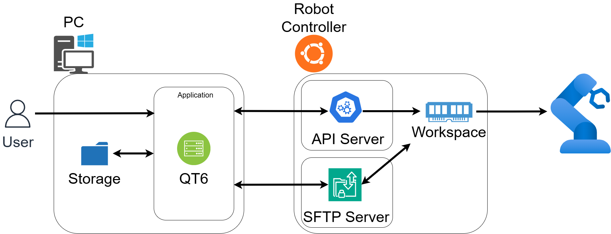
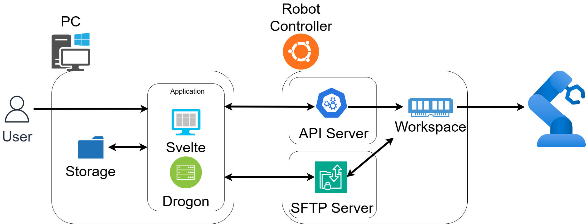

# RoboEditor

로봇 설정 및 작업 정보 비교편집 관리 툴

## 프로젝트 정보

- **팀 구성**: 6인 팀
- **개발 기간**: 2025.10.10 - 2025.11.20 (42일)
- **기술 스택**: C++ (Qt6, Drogon, Socket), Svelte

## 프로젝트 개요

RoboEditor는 삼성전자 생산기술연구소와의 기업연계 프로젝트로, 산업용 로봇의 설정 파일과 프로그램을 효율적으로 관리하고 비교·편집할 수 있는 통합 관리 도구입니다. 

기존의 번거로운 SFTP 명령어, 수동 압축 해제, 복잡한 버전 비교 작업을 직관적인 GUI로 간소화하여 현장 엔지니어의 생산성을 대폭 향상시킵니다. 특히 YAML과 Python 형식의 다양한 표기 방식 차이를 무시하고 **실제 데이터 변경사항만 정확하게 감지**하는 것이 핵심 기능입니다.

### 주요 기능

#### 1. 파일 및 폴더 비교 (구조 기반 파일 분석)

형식 차이를 무시하고 실제 변경 내용만 시각화합니다.

- **YAML 파일의 정규화 비교**: yaml-cpp 라이브러리를 사용하여 다양한 표기 방식을 데이터 구조로 정규화
  - 인라인 표기, 블록 표기 자동 인식
  - 키 순서 무시 비교
  - 공백 및 주석 차이 제거
- **Python 코드 구문 분석**: tree-sitter-python을 활용한 AST(추상 구문 트리) 기반 비교
- **변경점 하이라이팅**: 실제로 변경된 부분만 시각적으로 강조 표시

### **YAML 형식 정규화 예시:**

#### Yaml A (인라인 표기)
```yaml
list: [apple, banana, cherry]
map: {name: John, age: 30}
```

#### Yaml B (블록 표기)
```yaml
list:
  - apple
  - banana
  - cherry
map:
  name: John
  age: 30
```

#### 결과: 동일한 데이터로 인식 → 변경 없음으로 판정

#### 2. 안전한 백업 및 복원 (GUI 기반 자동화)

SFTP 기반 자동화된 파일 전송으로 보안과 효율성을 동시에 달성합니다.

- **자동 압축·압축 해제** (libarchive): 전송 데이터 크기 최소화
- **OpenSSL 기반 암호화 연결**: 모든 데이터 전송 보호
- **SFTP 프로토콜** (libssh2): SSH 채널 기반 안전한 원격 파일 전송
- **백업 파일 자동 관리**: 버전별 자동 저장 및 정리
- **원격 로봇 컨트롤러와의 안전한 동기화**

#### 3. 코드 편집 기능

- 직관적이고 친숙한 인터페이스 제공
- Monaco Editor로 강력한 편집기 사용 (Web)
- Yaml 유효성 검사

#### 4. 워크스페이스 관리 및 API 통합

- 로봇 제어기 서버 프로그램 제공
- 여러 로봇 프로젝트 동시 관리
- 로봇 기동 상태 실시간 조회
- 로봇 설정 파일 백업, 적용 관리

---

## 아키텍처

### Qt 버전



### 웹 버전



## 레포지토리 구조

### 1. RoboEditor Desktop (Qt6 C++)

Qt 기반 애플리케이션입니다.

**기술 스택**

- **Qt6**

**주요 기능**

- 워크스페이스 관리 및 프로젝트 조직화
- 파일 및 폴더 비교 (의미론적 비교)
- 실시간 코드 편집기 (구문 강조 포함)
- SFTP를 통한 원격 백업/복원
- 로봇 상태 모니터링 (API 연동)

### 2. RoboEditor Web Frontend (Svelte)

웹 기반 애플리케이션입니다.

**기술 스택**

- **Svelte**
- **Vite** 
- **Tailwind CSS**
- **Monaco Editor**

**주요 기능**

- Qt버전과 동일한 UI 지원
- Monaco Editor 탑재
- 브라우저 기반 접근 
- 모바일 호환성

**프로젝트 구조**

### 3. RoboEditor Web Backend (Drogon C++)

웹 기반 프로그램의 로직을 처리합니다.

**기술 스택**

- **Drogon**

**주요 기능**

- Qt버전과 동일한 기능 지원
- RESTful API 제공

### 4. Workspace Controller (C++)

API, SFTP 통신용 제어기 서버 프로그램입니다.

**기술 스택**

- **C++ Socket**

**주요 기능**

- 프레임워크 없이 Socket으로 구현한 경량 프로그램
- 로봇 제어기 사이드에서 Qt, Backend 프로그램과 통신하는 역할
- 로봇 상태 API와 원격 파일 압축/해제/적용 API 제공

---

## 팀원 및 역할

| 이름 | 담당 |
|------|---------|
| **양재호** | Qt UI 및 로직 개발 **\*팀장** |
| **유환성** | Qt UI 및 SFTP 통신 개발 |
| **손준호** | Qt UI 및 Web Frontend 개발 |
| **성기원** | 비교 기능 (Python, 폴더) 및 Web Frontend 개발 |
| **임혜성** | 비교 기능 (Yaml) 및 Infra 담당 |
| **김건우** | 제어기 서버 프로그램 및 Web Backend 개발 |

---

## 레포지토리

- **Qt**: [RoboEditor-Qt](https://github.com/LetsGoGTR/RoboEditor/tree/master/RoboEditor)
- **Web Frontend**: [RoboEditor-Frontend](https://github.com/LetsGoGTR/RoboEditor/tree/master/Svelte)
- **Web Backend**: [RoboEditor-Backend](https://github.com/LetsGoGTR/RoboEditor/tree/master/Drogon)
- **제어기 서버 프로그램**: [Workspace-Controller](https://github.com/LetsGoGTR/workspace-controller)
- **제어기 서버 프로그램 (Drogon 버전)**: [Workspace-Controller-Drogon](https://github.com/LetsGoGTR/workspace-controller-drogon)
